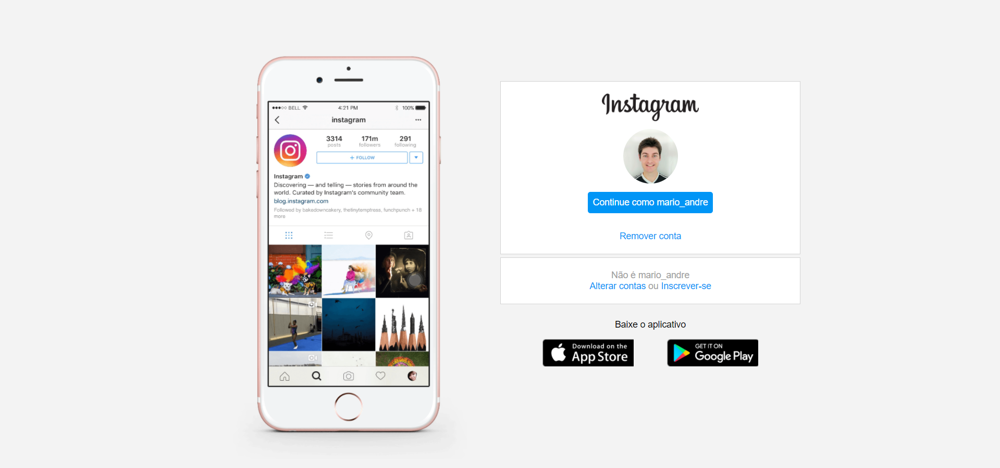

[](https://github.com/marioandre01)
[](#)
[](https://github.com/marioandre01/pagina_inicial_instagram-dio/stargazers)
[](https://github.com/marioandre01/pagina_inicial_instagram-dio/network/members)
[](https://github.com/marioandre01/pagina_inicial_instagram-dio/graphs/contributors)
[](https://github.com/marioandre01/pagina_inicial_instagram-dio/blob/master/LICENCE.md)


<h1 align="center">
    Página inicial instagram DIO
</h1>

<p align="center"> 
  <a href="#-projeto">Projeto</a>&nbsp;&nbsp;&nbsp;|&nbsp;&nbsp;&nbsp;
  <a href="#-tecnologias">Tecnologias</a>&nbsp;&nbsp;&nbsp;|&nbsp;&nbsp;&nbsp;
  <a href="#-layout">Layout</a>&nbsp;&nbsp;&nbsp;|&nbsp;&nbsp;&nbsp;
  <a href="#-executando-a-aplicação">Executando a aplicação</a>&nbsp;&nbsp;&nbsp;|&nbsp;&nbsp;&nbsp;
  <a href="#gear-contribuição">Contribuição</a>&nbsp;&nbsp;&nbsp;|&nbsp;&nbsp;&nbsp;
  <a href="#memo-licença">Licença</a>
</p>

## 💻 Projeto

Esse projeto foi desenvolvido através do [bootcamp everis Fullstack Developer](https://web.digitalinnovation.one/track/everis-fullstack-developer) oferecido pela [Digital Innovation One - DIO](https://digitalinnovation.one/). O projeto teve como objetivo recriar a página inicial do Instagram, que consiste na página de login. No seu desenvolvimento se usou HTML e CSS, onde na configuração do CSS foi utilizado para entender o seu conceito e uso a propriedade Flexbox para o posicionamento dos elementos e a funcionalidade de responsividade para que o layout do site se posicione adequadamente em telas de computador, tablet (1024px) e celulares (650px).

## 📋 Tecnologias

O projeto foi desenvolvido com as seguintes tecnologias:

- HTML
- CSS

## 🎨 Layout

<p align="center">
  
</p>


<!-- ## :bulb: Funcionamento da aplicação !-->


## 💻 Executando a aplicação

### Requisitos necessários

Para executar o projeto é necessário ter:
- Navegador web

### :octocat: Clonando o Repositório

```bash
$ git clone https://github.com/marioandre01/pagina_inicial_instagram-dio.git

# entre na pasta do projeto
$ cd pagina_inicial_instagram-dio
```
### 💻 Executando a aplicação

Abra o arquivo index.html

## :gear: Contribuição

Para contribuir com esse projeto faça os seguintes passos:

- Faça um fork desse repositório;
- Crie uma branch com a sua feature: `git checkout -b minha-feature`;
- Faça commit das suas alterações: `git commit -m 'feat: Minha nova feature'`;
- Faça push para a sua branch: `git push origin minha-feature`.

## :memo: Licença

Esse projeto está sob a licença MIT. Veja o arquivo [LICENCE](./LICENCE.md) para mais detalhes.


